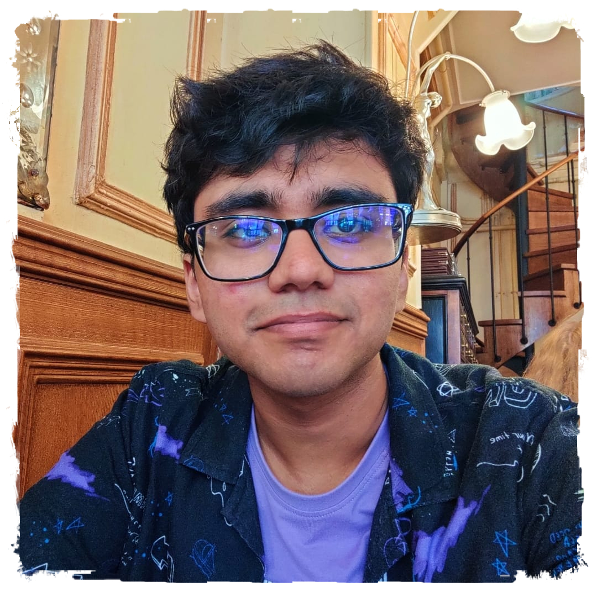

<!--  -->

<h1 style="color: #cc0000;">{{ site.jekyllacademic.homepage_title }}Hello World!</h1> 

Hi! I'm a first year PhD student in the Department of Electrical Engineering and Computer Science at [Oregon State University](https://engineering.oregonstate.edu/EECS), advised by [Mike Rosulek](https://web.engr.oregonstate.edu/~rosulekm/) and [Jiayu Xu](https://sites.google.com/view/jiayux). 

My primary research interests lie in Cryptography and Theoretical Computer Science. Broadly speaking, I am interested in all aspects of theoretical and applied cryptography, though my work has largely been on [secure multi-party computation](https://en.wikipedia.org/wiki/Secure_multi-party_computation). I am also interested in complexity theory, coding theory and more generally, algebra.

Prior to this, I completed my undergraduate degree in Mathematics and Computer Science in 2023 at [Chennai Mathematical Institute](cmi.ac.in), where I worked with [Akshayaram Srinivasan](https://www.cs.toronto.edu/~akshayaram/) and [Chaya Ganesh](https://www.csa.iisc.ac.in/~chaya/).

